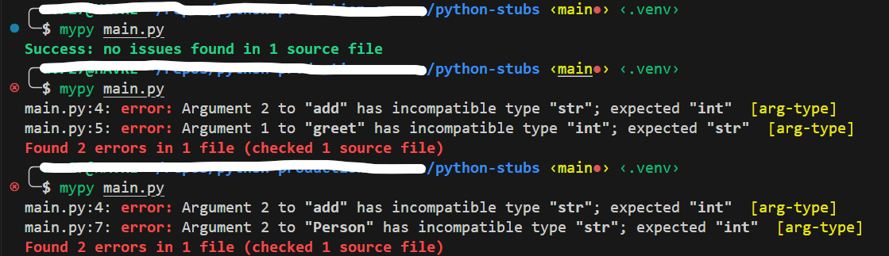

# Python Stub Files


A `.pyi` file in Python refers to a **Python stub file**. Stub files are used in Python for type hinting and are particularly associated with supporting static type checkers like `mypy`. These stub files have the `.pyi` extension to differentiate them from regular Python code files (`.py` files).


1. **Type Hints**: Python introduced type hinting in PEP 484, which allows you to specify types for variables, function parameters, and return values. Type hints are annotations used by static type checkers to analyze code for potential type errors.

2. **Stub Files**: In some cases, you may want to provide type hints for libraries or modules that are implemented in a different language (like C/C++/Rust), or for code that is not directly accessible to a static type checker. This is where stub files come into play.

3. **Purpose of `.pyi` Files**: A `.pyi` file serves as a Python stub file containing only type hints and no actual function or class implementations. It describes the types and interfaces of the corresponding `.py` modules without including any executable code.

4. **Static Type Checking**: Tools like `mypy` can use `.pyi` files to perform static type checking on Python code. These tools analyze the type hints in the stub files to detect potential type errors in your code.


Using `.pyi` files allows static type checking and type hinting even in scenarios where the actual implementation details are not directly available or required.


* **


```
.
├── mymodule
│   ├── __init__.py
│   ├── core.py
│   ├── core.pyi
│   ├── person.py
│   └── person.pyi
├── main.py
└── python-stubs.md
```


In this example:

- `core.py` contains actual implementations of functions `add` and `greet`.
- `core.pyi` contains stubs with type hints for the same functions.
- `person.py` contains the actual implementation of the `Person` class.
- `person.pyi` contains stubs with type hints for the `Person` class methods.
- `main.py` imports the `Person` class, and functions from `core.py` and uses its methods.





**Purpose of `.pyi` File**:

- The `.pyi` file (`core.pyi`) provides type hints to static type checkers like mypy.
- The `.pyi` file (`person.pyi`) provides type hints for the `Person` class.
- It enables static type checkers like mypy to perform type checking on `main.py` without requiring access to the implementation details of `core.py` and `person.py`.


**Static Type Checking**:
To perform static type checking using mypy, run:
```
mypy main.py
```
`mypy` will use the type hints specified in `core.pyi` and `person.pyi` to check the types in `main.py`:


**Benefits**:
- Separation of concerns: Actual implementation in `core.py` & `person.py`, type hints in `core.pyi` & `person.pyi`.
- Facilitates type checking without running the code.
- Useful for projects where implementations are not accessible (e.g., external libraries).
  

Using `.pyi` files is particularly helpful in larger projects or when working with external libraries where you want to leverage type hinting and static type checking effectively. They provide a clear separation between implementation details and type annotations, improving code maintainability and reliability.

* **

>**Credits:** ChatGPT for the explanation
